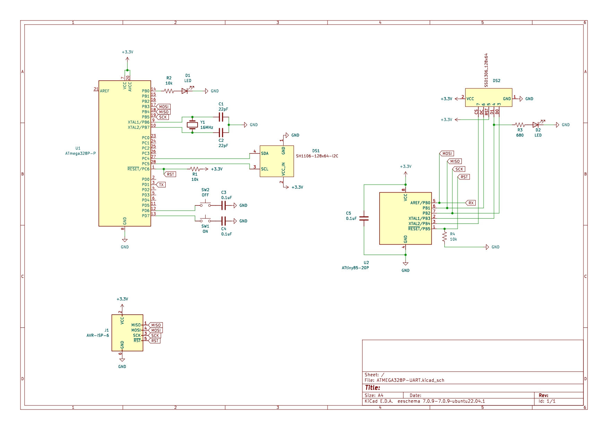

# Understanding AVR Microcontrollers
## Overview
Having played around with the [Arduino](https://www.arduino.cc/), I wanted to expand my knowledge by digging into the heart of Arduino's: [Atmel's AVR MCUs](https://en.wikipedia.org/wiki/AVR_microcontrollers). 

In general, differences between the two are how it's programmed. The Arduino makes it easily accessible to utilize tools without having to deal with the underlying hardware (using the C++ language), like the [AVR](https://www.nongnu.org/avr-libc/user-manual/) (using a version of C: avr-gcc) does.

The goal of this small project is to document my learning experience. This projects utilizes a simplex (one way) [UART](https://en.wikipedia.org/wiki/Universal_asynchronous_receiver-transmitter) communication between two AVR MCUs: [ATMega328P](https://www.microchip.com/en-us/product/atmega328p) and the [ATTiny85](https://www.microchip.com/en-us/product/ATtiny85)

The ATmega is bootloaded with [MiniCore](https://github.com/MCUdude/MiniCore), this will be used as a transmitter (TX).

The ATTiny85 is bootloaded with [TinyCore](https://github.com/SpenceKonde/ATTinyCore), this as a receiver (RX).

* Both the ATMega and ATTiny is provided a 3.3V power supply. 

* The transmitter is hooked up to two push buttons, and OLED display and a LED indicator to simply display the status of whether the LED is turned on or off. This action sends an 8-bit binary number.

* The receiver is also hooked up to an OLED to show the data sent. An LED is wired to the data pin of the OLED and will light up.

**(Schematic down below)**

## Hardware Resources
* +3.3V power supply
* 6 pin ISP programmer
* ATMega328P
* ATTiny85
* SH1106 128x64 I2C OLED
* SSD1306 128x64 SPI OLED
* 16 MHz crystal oscillator
* 10K ohm resistors - x3
* 680 ohm resistor
* 22pF capacitor - x2
* 0.1uF capacitor - x3
* Red LED
* Blue LED
* Tactile push buttons - x2

**(Resistors on RESET pins of the MCUs must be pulled to LOW (GND) when programming, HIGH (VCC) after programming)**

## Software Resources:
* [MiniCore](https://github.com/MCUdude/MiniCore)
* [TinyCore](https://github.com/SpenceKonde/ATTinyCore)
* [Technoblogy's ATTiny's Terminal code](http://www.technoblogy.com/show?TV4)
* [U8G2 Graphics for OLED](https://github.com/olikraus/u8g2)
* [avr-libc](https://www.nongnu.org/avr-libc/user-manual/modules.html)

**(Makefile included, this will include how to specifically compile the U8G2 library)**

### Schematic

## Issues
* I was not able to fully understand the code of Technoblogy's terminal and so I had set out to produce a minimal example. For now however, this is may be able to explain the idea.
